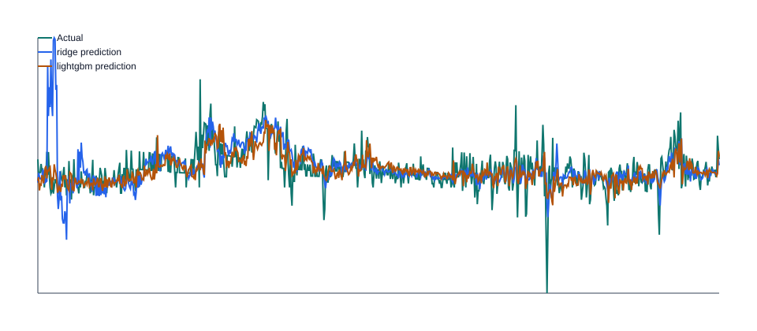

# Baseline CPI MoM Forecast Report

Run date: `2026-07-13`

## Data Coverage

| source | series_id | rows | first_date | last_date | first_release | last_release |
| --- | --- | --- | --- | --- | --- | --- |
| fred_public_csv_cpi_testing | CPIAUCSL | 952 | 1947-01-01 | 2026-05-01 | 1947-01-01 | 2026-05-01 |
| fred_public_csv_cpi_testing | CPILFESL | 832 | 1957-01-01 | 2026-05-01 | 1957-01-01 | 2026-05-01 |

## Features

Feature count: `43`

| feature | missing_values |
| --- | --- |
| headline_mom_lag_1 | 1 |
| headline_mom_lag_2 | 2 |
| headline_mom_lag_3 | 3 |
| headline_mom_lag_6 | 6 |
| headline_mom_lag_12 | 12 |
| core_mom_lag_1 | 121 |
| core_mom_lag_2 | 122 |
| core_mom_lag_3 | 123 |
| core_mom_lag_6 | 126 |
| core_mom_lag_12 | 132 |
| headline_yoy_lag_1 | 12 |
| headline_yoy_lag_2 | 13 |
| headline_yoy_lag_3 | 14 |
| headline_yoy_lag_6 | 17 |
| headline_yoy_lag_12 | 23 |
| core_yoy_lag_1 | 132 |
| core_yoy_lag_2 | 133 |
| core_yoy_lag_3 | 134 |
| core_yoy_lag_6 | 137 |
| core_yoy_lag_12 | 143 |
| headline_index_lag_1 | 0 |
| headline_index_lag_2 | 1 |
| headline_index_lag_3 | 2 |
| headline_index_lag_6 | 5 |
| headline_index_lag_12 | 11 |
| core_index_lag_1 | 120 |
| core_index_lag_2 | 121 |
| core_index_lag_3 | 122 |
| core_index_lag_6 | 125 |
| core_index_lag_12 | 131 |
| core_minus_headline_mom_lag_1 | 121 |
| headline_mom_rolling_mean_3 | 3 |
| headline_mom_rolling_std_3 | 3 |
| core_mom_rolling_mean_3 | 123 |
| core_mom_rolling_std_3 | 123 |
| headline_mom_rolling_mean_6 | 6 |
| headline_mom_rolling_std_6 | 6 |
| core_mom_rolling_mean_6 | 126 |
| core_mom_rolling_std_6 | 126 |
| headline_mom_rolling_mean_12 | 12 |
| headline_mom_rolling_std_12 | 12 |
| core_mom_rolling_mean_12 | 132 |
| core_mom_rolling_std_12 | 132 |

## Parameters

| parameter | value |
| --- | --- |
| min_train_size | 120 |
| test_size | 12 |
| step_size | 12 |
| allow_partial_test_window | True |
| imputation_strategy | median |
| ridge_alpha | 1 |
| lightgbm_params | n_estimators=150, learning_rate=0.03, min_child_samples=12, n_jobs=1, verbosity=-1, random_state=7 |

## Fold Results

| model | model_name | fold_id | train_start | train_end | test_start | test_end | observations | rmse | mae | directional_accuracy | hit_rate_vs_naive | model_beats_naive_rmse |
| --- | --- | --- | --- | --- | --- | --- | --- | --- | --- | --- | --- | --- |
| ridge | ridge | 0 | 1947-02-01 | 1957-01-01 | 1957-02-01 | 1958-01-01 | 12 | 0.00213635 | 0.00162116 | 0.916667 | 0.583333 | False |
| ridge | ridge | 1 | 1947-02-01 | 1958-01-01 | 1958-02-01 | 1959-01-01 | 12 | 0.0180609 | 0.0170984 | 0.583333 | 0 | False |
| ridge | ridge | 2 | 1947-02-01 | 1959-01-01 | 1959-02-01 | 1960-01-01 | 12 | 0.0054401 | 0.00467331 | 0.333333 | 0.166667 | False |
| ridge | ridge | 3 | 1947-02-01 | 1960-01-01 | 1960-02-01 | 1961-01-01 | 12 | 0.00187549 | 0.00138664 | 0.666667 | 0.833333 | True |
| ridge | ridge | 4 | 1947-02-01 | 1961-01-01 | 1961-02-01 | 1962-01-01 | 12 | 0.00350193 | 0.00302533 | 0.5 | 0.166667 | False |
| ridge | ridge | 5 | 1947-02-01 | 1962-01-01 | 1962-02-01 | 1963-01-01 | 12 | 0.00200976 | 0.00165663 | 0.5 | 0.416667 | False |
| ridge | ridge | 6 | 1947-02-01 | 1963-01-01 | 1963-02-01 | 1964-01-01 | 12 | 0.00236309 | 0.00204261 | 0.416667 | 0.333333 | False |
| ridge | ridge | 7 | 1947-02-01 | 1964-01-01 | 1964-02-01 | 1965-01-01 | 12 | 0.000790243 | 0.000655723 | 0.916667 | 0.916667 | True |
| ridge | ridge | 8 | 1947-02-01 | 1965-01-01 | 1965-02-01 | 1966-01-01 | 12 | 0.00198531 | 0.00164673 | 0.5 | 0.416667 | False |
| ridge | ridge | 9 | 1947-02-01 | 1966-01-01 | 1966-02-01 | 1967-01-01 | 12 | 0.00268556 | 0.00236879 | 0.75 | 0.416667 | False |
| ridge | ridge | 10 | 1947-02-01 | 1967-01-01 | 1967-02-01 | 1968-01-01 | 12 | 0.00294787 | 0.0024869 | 0.666667 | 0.75 | True |
| ridge | ridge | 11 | 1947-02-01 | 1968-01-01 | 1968-02-01 | 1969-01-01 | 12 | 0.00177457 | 0.00161621 | 1 | 0.333333 | False |
| ridge | ridge | 12 | 1947-02-01 | 1969-01-01 | 1969-02-01 | 1970-01-01 | 12 | 0.00177282 | 0.00127474 | 1 | 0.666667 | True |
| ridge | ridge | 13 | 1947-02-01 | 1970-01-01 | 1970-02-01 | 1971-01-01 | 12 | 0.00228373 | 0.00157642 | 1 | 0.166667 | False |
| ridge | ridge | 14 | 1947-02-01 | 1971-01-01 | 1971-02-01 | 1972-01-01 | 12 | 0.00193149 | 0.00178983 | 0.916667 | 0.166667 | False |
| ridge | ridge | 15 | 1947-02-01 | 1972-01-01 | 1972-02-01 | 1973-01-01 | 12 | 0.00168258 | 0.00131251 | 0.916667 | 0.0833333 | False |
| ridge | ridge | 16 | 1947-02-01 | 1973-01-01 | 1973-02-01 | 1974-01-01 | 12 | 0.0062994 | 0.00510618 | 0.916667 | 0.166667 | False |
| ridge | ridge | 17 | 1947-02-01 | 1974-01-01 | 1974-02-01 | 1975-01-01 | 12 | 0.00295029 | 0.00250024 | 1 | 0.5 | False |
| ridge | ridge | 18 | 1947-02-01 | 1975-01-01 | 1975-02-01 | 1976-01-01 | 12 | 0.00307059 | 0.00262349 | 1 | 0.416667 | True |
| ridge | ridge | 19 | 1947-02-01 | 1976-01-01 | 1976-02-01 | 1977-01-01 | 12 | 0.0034028 | 0.00272403 | 1 | 0.5 | False |
| ridge | ridge | 20 | 1947-02-01 | 1977-01-01 | 1977-02-01 | 1978-01-01 | 12 | 0.002542 | 0.00238458 | 1 | 0.333333 | False |
| ridge | ridge | 21 | 1947-02-01 | 1978-01-01 | 1978-02-01 | 1979-01-01 | 12 | 0.0013442 | 0.0010539 | 1 | 0.583333 | True |
| ridge | ridge | 22 | 1947-02-01 | 1979-01-01 | 1979-02-01 | 1980-01-01 | 12 | 0.00214516 | 0.00178403 | 1 | 0.583333 | True |
| ridge | ridge | 23 | 1947-02-01 | 1980-01-01 | 1980-02-01 | 1981-01-01 | 12 | 0.00311592 | 0.00195674 | 1 | 0.916667 | True |
| ridge | ridge | 24 | 1947-02-01 | 1981-01-01 | 1981-02-01 | 1982-01-01 | 12 | 0.00402734 | 0.00328586 | 1 | 0.333333 | False |
| ridge | ridge | 25 | 1947-02-01 | 1982-01-01 | 1982-02-01 | 1983-01-01 | 12 | 0.00511966 | 0.00463411 | 0.666667 | 0.166667 | False |
| ridge | ridge | 26 | 1947-02-01 | 1983-01-01 | 1983-02-01 | 1984-01-01 | 12 | 0.00238023 | 0.0020123 | 1 | 0.416667 | False |
| ridge | ridge | 27 | 1947-02-01 | 1984-01-01 | 1984-02-01 | 1985-01-01 | 12 | 0.00316348 | 0.00298125 | 1 | 0.916667 | True |
| ridge | ridge | 28 | 1947-02-01 | 1985-01-01 | 1985-02-01 | 1986-01-01 | 12 | 0.0013742 | 0.00112527 | 1 | 0.583333 | True |
| ridge | ridge | 29 | 1947-02-01 | 1986-01-01 | 1986-02-01 | 1987-01-01 | 12 | 0.00328824 | 0.00263101 | 0.666667 | 0.583333 | True |
| ridge | ridge | 30 | 1947-02-01 | 1987-01-01 | 1987-02-01 | 1988-01-01 | 12 | 0.001089 | 0.000957495 | 1 | 0.916667 | True |
| ridge | ridge | 31 | 1947-02-01 | 1988-01-01 | 1988-02-01 | 1989-01-01 | 12 | 0.00132906 | 0.00108632 | 1 | 0.333333 | False |
| ridge | ridge | 32 | 1947-02-01 | 1989-01-01 | 1989-02-01 | 1990-01-01 | 12 | 0.00251384 | 0.0016817 | 0.916667 | 0.5 | False |
| ridge | ridge | 33 | 1947-02-01 | 1990-01-01 | 1990-02-01 | 1991-01-01 | 12 | 0.00190373 | 0.0016315 | 1 | 0.833333 | True |
| ridge | ridge | 34 | 1947-02-01 | 1991-01-01 | 1991-02-01 | 1992-01-01 | 12 | 0.00193184 | 0.00148656 | 0.916667 | 0.666667 | True |
| ridge | ridge | 35 | 1947-02-01 | 1992-01-01 | 1992-02-01 | 1993-01-01 | 12 | 0.000809939 | 0.000625711 | 1 | 0.916667 | True |
| ridge | ridge | 36 | 1947-02-01 | 1993-01-01 | 1993-02-01 | 1994-01-01 | 12 | 0.00127252 | 0.0010068 | 0.916667 | 0.833333 | True |
| ridge | ridge | 37 | 1947-02-01 | 1994-01-01 | 1994-02-01 | 1995-01-01 | 12 | 0.000920175 | 0.00082745 | 1 | 0.833333 | True |
| ridge | ridge | 38 | 1947-02-01 | 1995-01-01 | 1995-02-01 | 1996-01-01 | 12 | 0.00126706 | 0.000968689 | 1 | 0.583333 | False |
| ridge | ridge | 39 | 1947-02-01 | 1996-01-01 | 1996-02-01 | 1997-01-01 | 12 | 0.000789987 | 0.000652669 | 1 | 0.916667 | True |
| ridge | ridge | 40 | 1947-02-01 | 1997-01-01 | 1997-02-01 | 1998-01-01 | 12 | 0.000871935 | 0.000745447 | 0.916667 | 0.5 | True |
| ridge | ridge | 41 | 1947-02-01 | 1998-01-01 | 1998-02-01 | 1999-01-01 | 12 | 0.000790361 | 0.000655565 | 0.833333 | 0.416667 | True |
| ridge | ridge | 42 | 1947-02-01 | 1999-01-01 | 1999-02-01 | 2000-01-01 | 12 | 0.00229503 | 0.00167474 | 0.833333 | 0.5 | False |
| ridge | ridge | 43 | 1947-02-01 | 2000-01-01 | 2000-02-01 | 2001-01-01 | 12 | 0.00235579 | 0.00193864 | 0.833333 | 0.416667 | False |
| ridge | ridge | 44 | 1947-02-01 | 2001-01-01 | 2001-02-01 | 2002-01-01 | 12 | 0.00261763 | 0.00218068 | 0.5 | 0.833333 | True |
| ridge | ridge | 45 | 1947-02-01 | 2002-01-01 | 2002-02-01 | 2003-01-01 | 12 | 0.00143008 | 0.00107158 | 1 | 0.333333 | False |
| ridge | ridge | 46 | 1947-02-01 | 2003-01-01 | 2003-02-01 | 2004-01-01 | 12 | 0.00253165 | 0.00219337 | 0.75 | 0.583333 | True |
| ridge | ridge | 47 | 1947-02-01 | 2004-01-01 | 2004-02-01 | 2005-01-01 | 12 | 0.0015937 | 0.00147306 | 0.833333 | 0.583333 | True |
| ridge | ridge | 48 | 1947-02-01 | 2005-01-01 | 2005-02-01 | 2006-01-01 | 12 | 0.00438181 | 0.0032761 | 0.75 | 0.666667 | True |
| ridge | ridge | 49 | 1947-02-01 | 2006-01-01 | 2006-02-01 | 2007-01-01 | 12 | 0.00310864 | 0.00254092 | 0.833333 | 0.75 | True |
| ridge | ridge | 50 | 1947-02-01 | 2007-01-01 | 2007-02-01 | 2008-01-01 | 12 | 0.00204475 | 0.0015675 | 1 | 0.583333 | True |
| ridge | ridge | 51 | 1947-02-01 | 2008-01-01 | 2008-02-01 | 2009-01-01 | 12 | 0.00640104 | 0.00471625 | 0.75 | 0.666667 | True |
| ridge | ridge | 52 | 1947-02-01 | 2009-01-01 | 2009-02-01 | 2010-01-01 | 12 | 0.00385522 | 0.00293371 | 0.583333 | 0.25 | False |
| ridge | ridge | 53 | 1947-02-01 | 2010-01-01 | 2010-02-01 | 2011-01-01 | 12 | 0.00146127 | 0.00125365 | 0.75 | 0.666667 | True |
| ridge | ridge | 54 | 1947-02-01 | 2011-01-01 | 2011-02-01 | 2012-01-01 | 12 | 0.00147091 | 0.00117743 | 0.916667 | 0.5 | True |
| ridge | ridge | 55 | 1947-02-01 | 2012-01-01 | 2012-02-01 | 2013-01-01 | 12 | 0.00224442 | 0.00165495 | 0.666667 | 0.666667 | True |
| ridge | ridge | 56 | 1947-02-01 | 2013-01-01 | 2013-02-01 | 2014-01-01 | 12 | 0.00225731 | 0.00148502 | 0.916667 | 0.5 | False |
| ridge | ridge | 57 | 1947-02-01 | 2014-01-01 | 2014-02-01 | 2015-01-01 | 12 | 0.0023379 | 0.00165706 | 0.666667 | 0.833333 | True |
| ridge | ridge | 58 | 1947-02-01 | 2015-01-01 | 2015-02-01 | 2016-01-01 | 12 | 0.00245161 | 0.00201214 | 0.583333 | 1 | True |
| ridge | ridge | 59 | 1947-02-01 | 2016-01-01 | 2016-02-01 | 2017-01-01 | 12 | 0.00144192 | 0.00116368 | 0.833333 | 0.833333 | True |
| ridge | ridge | 60 | 1947-02-01 | 2017-01-01 | 2017-02-01 | 2018-01-01 | 12 | 0.0019643 | 0.00174813 | 0.833333 | 0.666667 | True |
| ridge | ridge | 61 | 1947-02-01 | 2018-01-01 | 2018-02-01 | 2019-01-01 | 12 | 0.00131558 | 0.00107115 | 0.833333 | 1 | True |
| ridge | ridge | 62 | 1947-02-01 | 2019-01-01 | 2019-02-01 | 2020-01-01 | 12 | 0.00136073 | 0.00120024 | 0.916667 | 0.833333 | True |
| ridge | ridge | 63 | 1947-02-01 | 2020-01-01 | 2020-02-01 | 2021-01-01 | 12 | 0.00332357 | 0.0026338 | 0.833333 | 0.583333 | True |
| ridge | ridge | 64 | 1947-02-01 | 2021-01-01 | 2021-02-01 | 2022-01-01 | 12 | 0.00227859 | 0.00178446 | 1 | 0.916667 | True |
| ridge | ridge | 65 | 1947-02-01 | 2022-01-01 | 2022-02-01 | 2023-01-01 | 12 | 0.00426749 | 0.00361764 | 0.916667 | 0.416667 | False |
| ridge | ridge | 66 | 1947-02-01 | 2023-01-01 | 2023-02-01 | 2024-01-01 | 12 | 0.00111555 | 0.000972796 | 1 | 0.916667 | True |
| ridge | ridge | 67 | 1947-02-01 | 2024-01-01 | 2024-02-01 | 2025-01-01 | 12 | 0.00119819 | 0.000967614 | 0.916667 | 0.583333 | True |
| ridge | ridge | 68 | 1947-02-01 | 2025-01-01 | 2025-02-01 | 2026-02-01 | 12 | 0.00082026 | 0.000644589 | 1 | 0.916667 | True |
| ridge | ridge | 69 | 1947-02-01 | 2026-02-01 | 2026-03-01 | 2026-05-01 | 3 | 0.00363562 | 0.00287579 | 1 | 0.666667 | True |
| lightgbm | lightgbm | 0 | 1947-02-01 | 1957-01-01 | 1957-02-01 | 1958-01-01 | 12 | 0.00238912 | 0.00198066 | 0.833333 | 0.416667 | False |
| lightgbm | lightgbm | 1 | 1947-02-01 | 1958-01-01 | 1958-02-01 | 1959-01-01 | 12 | 0.00215443 | 0.0017194 | 0.666667 | 0.916667 | True |
| lightgbm | lightgbm | 2 | 1947-02-01 | 1959-01-01 | 1959-02-01 | 1960-01-01 | 12 | 0.00164988 | 0.00133553 | 0.666667 | 0.5 | False |
| lightgbm | lightgbm | 3 | 1947-02-01 | 1960-01-01 | 1960-02-01 | 1961-01-01 | 12 | 0.00262588 | 0.0018686 | 0.416667 | 0.916667 | True |
| lightgbm | lightgbm | 4 | 1947-02-01 | 1961-01-01 | 1961-02-01 | 1962-01-01 | 12 | 0.000791515 | 0.000561369 | 0.5 | 0.666667 | True |
| lightgbm | lightgbm | 5 | 1947-02-01 | 1962-01-01 | 1962-02-01 | 1963-01-01 | 12 | 0.0019554 | 0.00147213 | 0.583333 | 0.5 | False |
| lightgbm | lightgbm | 6 | 1947-02-01 | 1963-01-01 | 1963-02-01 | 1964-01-01 | 12 | 0.00120837 | 0.00106353 | 0.916667 | 0.583333 | True |
| lightgbm | lightgbm | 7 | 1947-02-01 | 1964-01-01 | 1964-02-01 | 1965-01-01 | 12 | 0.00111594 | 0.000810324 | 0.833333 | 0.833333 | True |
| lightgbm | lightgbm | 8 | 1947-02-01 | 1965-01-01 | 1965-02-01 | 1966-01-01 | 12 | 0.00171506 | 0.00141979 | 0.666667 | 0.416667 | True |
| lightgbm | lightgbm | 9 | 1947-02-01 | 1966-01-01 | 1966-02-01 | 1967-01-01 | 12 | 0.00238323 | 0.00156881 | 0.916667 | 0.666667 | True |
| lightgbm | lightgbm | 10 | 1947-02-01 | 1967-01-01 | 1967-02-01 | 1968-01-01 | 12 | 0.0022708 | 0.00186375 | 0.75 | 0.833333 | True |
| lightgbm | lightgbm | 11 | 1947-02-01 | 1968-01-01 | 1968-02-01 | 1969-01-01 | 12 | 0.00225084 | 0.00165212 | 1 | 0.0833333 | False |
| lightgbm | lightgbm | 12 | 1947-02-01 | 1969-01-01 | 1969-02-01 | 1970-01-01 | 12 | 0.00245455 | 0.00206056 | 1 | 0.583333 | True |
| lightgbm | lightgbm | 13 | 1947-02-01 | 1970-01-01 | 1970-02-01 | 1971-01-01 | 12 | 0.00143974 | 0.00105783 | 1 | 0.416667 | True |
| lightgbm | lightgbm | 14 | 1947-02-01 | 1971-01-01 | 1971-02-01 | 1972-01-01 | 12 | 0.00162878 | 0.00132842 | 0.916667 | 0.166667 | False |
| lightgbm | lightgbm | 15 | 1947-02-01 | 1972-01-01 | 1972-02-01 | 1973-01-01 | 12 | 0.00149084 | 0.00121312 | 0.916667 | 0.25 | True |
| lightgbm | lightgbm | 16 | 1947-02-01 | 1973-01-01 | 1973-02-01 | 1974-01-01 | 12 | 0.00642389 | 0.00522661 | 0.916667 | 0.0833333 | False |
| lightgbm | lightgbm | 17 | 1947-02-01 | 1974-01-01 | 1974-02-01 | 1975-01-01 | 12 | 0.00321088 | 0.00241474 | 1 | 0.5 | False |
| lightgbm | lightgbm | 18 | 1947-02-01 | 1975-01-01 | 1975-02-01 | 1976-01-01 | 12 | 0.00389407 | 0.00326271 | 1 | 0.416667 | False |
| lightgbm | lightgbm | 19 | 1947-02-01 | 1976-01-01 | 1976-02-01 | 1977-01-01 | 12 | 0.00200771 | 0.00159116 | 1 | 0.666667 | False |
| lightgbm | lightgbm | 20 | 1947-02-01 | 1977-01-01 | 1977-02-01 | 1978-01-01 | 12 | 0.0016187 | 0.00120218 | 1 | 0.5 | True |
| lightgbm | lightgbm | 21 | 1947-02-01 | 1978-01-01 | 1978-02-01 | 1979-01-01 | 12 | 0.00272877 | 0.00233652 | 1 | 0.333333 | False |
| lightgbm | lightgbm | 22 | 1947-02-01 | 1979-01-01 | 1979-02-01 | 1980-01-01 | 12 | 0.00399409 | 0.00378311 | 1 | 0 | False |
| lightgbm | lightgbm | 23 | 1947-02-01 | 1980-01-01 | 1980-02-01 | 1981-01-01 | 12 | 0.00335136 | 0.00217805 | 1 | 0.833333 | True |
| lightgbm | lightgbm | 24 | 1947-02-01 | 1981-01-01 | 1981-02-01 | 1982-01-01 | 12 | 0.00237385 | 0.00178152 | 1 | 0.5 | True |
| lightgbm | lightgbm | 25 | 1947-02-01 | 1982-01-01 | 1982-02-01 | 1983-01-01 | 12 | 0.00416027 | 0.00352258 | 0.666667 | 0.416667 | False |
| lightgbm | lightgbm | 26 | 1947-02-01 | 1983-01-01 | 1983-02-01 | 1984-01-01 | 12 | 0.00214044 | 0.00177684 | 1 | 0.416667 | True |
| lightgbm | lightgbm | 27 | 1947-02-01 | 1984-01-01 | 1984-02-01 | 1985-01-01 | 12 | 0.00207906 | 0.00199714 | 1 | 1 | True |
| lightgbm | lightgbm | 28 | 1947-02-01 | 1985-01-01 | 1985-02-01 | 1986-01-01 | 12 | 0.00155377 | 0.00134161 | 1 | 0.583333 | True |
| lightgbm | lightgbm | 29 | 1947-02-01 | 1986-01-01 | 1986-02-01 | 1987-01-01 | 12 | 0.00342441 | 0.00266923 | 0.75 | 0.583333 | True |
| lightgbm | lightgbm | 30 | 1947-02-01 | 1987-01-01 | 1987-02-01 | 1988-01-01 | 12 | 0.00157618 | 0.00133651 | 1 | 0.666667 | True |
| lightgbm | lightgbm | 31 | 1947-02-01 | 1988-01-01 | 1988-02-01 | 1989-01-01 | 12 | 0.00165038 | 0.00141475 | 1 | 0.25 | False |
| lightgbm | lightgbm | 32 | 1947-02-01 | 1989-01-01 | 1989-02-01 | 1990-01-01 | 12 | 0.00266755 | 0.00192411 | 0.916667 | 0.416667 | False |
| lightgbm | lightgbm | 33 | 1947-02-01 | 1990-01-01 | 1990-02-01 | 1991-01-01 | 12 | 0.0024362 | 0.00208299 | 1 | 0.916667 | True |
| lightgbm | lightgbm | 34 | 1947-02-01 | 1991-01-01 | 1991-02-01 | 1992-01-01 | 12 | 0.00248905 | 0.00212269 | 0.916667 | 0.25 | False |
| lightgbm | lightgbm | 35 | 1947-02-01 | 1992-01-01 | 1992-02-01 | 1993-01-01 | 12 | 0.00123944 | 0.00101613 | 1 | 0.75 | True |
| lightgbm | lightgbm | 36 | 1947-02-01 | 1993-01-01 | 1993-02-01 | 1994-01-01 | 12 | 0.00144916 | 0.00121471 | 0.916667 | 0.833333 | True |
| lightgbm | lightgbm | 37 | 1947-02-01 | 1994-01-01 | 1994-02-01 | 1995-01-01 | 12 | 0.00110792 | 0.000916039 | 1 | 0.833333 | True |
| lightgbm | lightgbm | 38 | 1947-02-01 | 1995-01-01 | 1995-02-01 | 1996-01-01 | 12 | 0.00117779 | 0.00098693 | 1 | 0.583333 | True |
| lightgbm | lightgbm | 39 | 1947-02-01 | 1996-01-01 | 1996-02-01 | 1997-01-01 | 12 | 0.000676893 | 0.000623438 | 1 | 1 | True |
| lightgbm | lightgbm | 40 | 1947-02-01 | 1997-01-01 | 1997-02-01 | 1998-01-01 | 12 | 0.00114267 | 0.000954055 | 0.916667 | 0.25 | False |
| lightgbm | lightgbm | 41 | 1947-02-01 | 1998-01-01 | 1998-02-01 | 1999-01-01 | 12 | 0.000916497 | 0.00077496 | 0.833333 | 0.416667 | False |
| lightgbm | lightgbm | 42 | 1947-02-01 | 1999-01-01 | 1999-02-01 | 2000-01-01 | 12 | 0.0024731 | 0.00189189 | 0.833333 | 0.333333 | False |
| lightgbm | lightgbm | 43 | 1947-02-01 | 2000-01-01 | 2000-02-01 | 2001-01-01 | 12 | 0.00241554 | 0.00197095 | 0.833333 | 0.416667 | False |
| lightgbm | lightgbm | 44 | 1947-02-01 | 2001-01-01 | 2001-02-01 | 2002-01-01 | 12 | 0.00232857 | 0.00188966 | 0.583333 | 0.833333 | True |
| lightgbm | lightgbm | 45 | 1947-02-01 | 2002-01-01 | 2002-02-01 | 2003-01-01 | 12 | 0.00125374 | 0.00103367 | 1 | 0.25 | True |
| lightgbm | lightgbm | 46 | 1947-02-01 | 2003-01-01 | 2003-02-01 | 2004-01-01 | 12 | 0.00251814 | 0.00199247 | 0.666667 | 0.666667 | True |
| lightgbm | lightgbm | 47 | 1947-02-01 | 2004-01-01 | 2004-02-01 | 2005-01-01 | 12 | 0.00120543 | 0.000981944 | 0.833333 | 0.666667 | True |
| lightgbm | lightgbm | 48 | 1947-02-01 | 2005-01-01 | 2005-02-01 | 2006-01-01 | 12 | 0.00374516 | 0.00290451 | 0.75 | 0.583333 | True |
| lightgbm | lightgbm | 49 | 1947-02-01 | 2006-01-01 | 2006-02-01 | 2007-01-01 | 12 | 0.00277662 | 0.00211938 | 0.916667 | 0.666667 | True |
| lightgbm | lightgbm | 50 | 1947-02-01 | 2007-01-01 | 2007-02-01 | 2008-01-01 | 12 | 0.00227009 | 0.00190177 | 1 | 0.583333 | True |
| lightgbm | lightgbm | 51 | 1947-02-01 | 2008-01-01 | 2008-02-01 | 2009-01-01 | 12 | 0.00661871 | 0.00475924 | 0.75 | 0.583333 | True |
| lightgbm | lightgbm | 52 | 1947-02-01 | 2009-01-01 | 2009-02-01 | 2010-01-01 | 12 | 0.00408327 | 0.00298806 | 0.5 | 0.25 | False |
| lightgbm | lightgbm | 53 | 1947-02-01 | 2010-01-01 | 2010-02-01 | 2011-01-01 | 12 | 0.00201037 | 0.00170944 | 0.75 | 0.166667 | False |
| lightgbm | lightgbm | 54 | 1947-02-01 | 2011-01-01 | 2011-02-01 | 2012-01-01 | 12 | 0.00195553 | 0.00168933 | 0.916667 | 0.333333 | False |
| lightgbm | lightgbm | 55 | 1947-02-01 | 2012-01-01 | 2012-02-01 | 2013-01-01 | 12 | 0.00239056 | 0.00185336 | 0.666667 | 0.666667 | True |
| lightgbm | lightgbm | 56 | 1947-02-01 | 2013-01-01 | 2013-02-01 | 2014-01-01 | 12 | 0.00180823 | 0.0011619 | 0.916667 | 0.75 | True |
| lightgbm | lightgbm | 57 | 1947-02-01 | 2014-01-01 | 2014-02-01 | 2015-01-01 | 12 | 0.00282222 | 0.00196107 | 0.583333 | 0.916667 | True |
| lightgbm | lightgbm | 58 | 1947-02-01 | 2015-01-01 | 2015-02-01 | 2016-01-01 | 12 | 0.00265671 | 0.00222156 | 0.333333 | 1 | True |
| lightgbm | lightgbm | 59 | 1947-02-01 | 2016-01-01 | 2016-02-01 | 2017-01-01 | 12 | 0.00208445 | 0.00184363 | 0.75 | 0.75 | True |
| lightgbm | lightgbm | 60 | 1947-02-01 | 2017-01-01 | 2017-02-01 | 2018-01-01 | 12 | 0.00201237 | 0.00170267 | 0.75 | 0.666667 | True |
| lightgbm | lightgbm | 61 | 1947-02-01 | 2018-01-01 | 2018-02-01 | 2019-01-01 | 12 | 0.0017839 | 0.00142537 | 0.833333 | 1 | True |
| lightgbm | lightgbm | 62 | 1947-02-01 | 2019-01-01 | 2019-02-01 | 2020-01-01 | 12 | 0.00138473 | 0.00110786 | 0.916667 | 0.75 | True |
| lightgbm | lightgbm | 63 | 1947-02-01 | 2020-01-01 | 2020-02-01 | 2021-01-01 | 12 | 0.00333357 | 0.00232424 | 0.833333 | 0.75 | True |
| lightgbm | lightgbm | 64 | 1947-02-01 | 2021-01-01 | 2021-02-01 | 2022-01-01 | 12 | 0.00327866 | 0.00250211 | 1 | 0.833333 | True |
| lightgbm | lightgbm | 65 | 1947-02-01 | 2022-01-01 | 2022-02-01 | 2023-01-01 | 12 | 0.00424433 | 0.00354112 | 0.916667 | 0.333333 | False |
| lightgbm | lightgbm | 66 | 1947-02-01 | 2023-01-01 | 2023-02-01 | 2024-01-01 | 12 | 0.00166447 | 0.00143497 | 1 | 0.833333 | True |
| lightgbm | lightgbm | 67 | 1947-02-01 | 2024-01-01 | 2024-02-01 | 2025-01-01 | 12 | 0.00146834 | 0.00117968 | 0.916667 | 0.583333 | True |
| lightgbm | lightgbm | 68 | 1947-02-01 | 2025-01-01 | 2025-02-01 | 2026-02-01 | 12 | 0.000900718 | 0.000730623 | 1 | 0.916667 | True |
| lightgbm | lightgbm | 69 | 1947-02-01 | 2026-02-01 | 2026-03-01 | 2026-05-01 | 3 | 0.00363591 | 0.00232881 | 1 | 0.666667 | True |

## Summary Metrics

| model | rmse | mae | directional_accuracy | hit_rate_vs_naive | naive_rmse | naive_mae | beats_naive_rmse | naive_comparison |
| --- | --- | --- | --- | --- | --- | --- | --- | --- |
| ridge | 0.00340845 | 0.00211828 | 0.849579 | 0.575211 | 0.00324057 | 0.00236131 | False | Model does not beat the naive last-value baseline on out-of-sample RMSE. |
| lightgbm | 0.0025623 | 0.00183151 | 0.858002 | 0.577617 | 0.00324057 | 0.00236131 | True | Model beats the naive last-value baseline on out-of-sample RMSE. |

- `ridge`: Model does not beat the naive last-value baseline on out-of-sample RMSE.
- `lightgbm`: Model beats the naive last-value baseline on out-of-sample RMSE.

## Predicted Versus Actual

